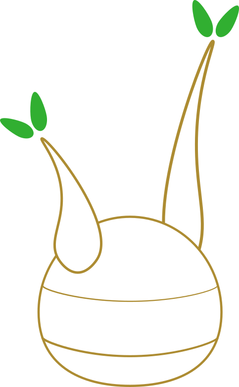

# caudex

[](https://github.com/wikibonsai/wikibonsai)
[](https://npmjs.org/package/caudex)

<p align="center">
  
</p>

.[^inspire]

An index/db for tracking complex relationships in collections, such as personal [wiki](https://github.com/wikibonsai/wikirefs)s, with support for a [semantic tree](https://github.com/wikibonsai/semtree).

🍄 Germinate connections in your [🎋 WikiBonsai](https://github.com/wikibonsai/wikibonsai) digital garden.

## Install

Install with [npm](https://docs.npmjs.com/cli/v9/commands/npm-install):

```
npm install caudex
```

## Use

If you have some file data you want to store or index...

```js
import { create } from 'caudex';

let fileData = [
  {
    id: '<some-unique-id>',
    filename: 'fname',
    uri: '/uri',
    title: 'Title',
    type: 'default',
  },
  // ...
];
const caudex = create(fileData);
```

...Or just a web (graph):

```js
import { createWeb } from 'caudex';

const web = createWeb(fileData);
```

...Or just a tree:

```js
import { createTree } from 'caudex';

const tree = createTree(fileData);
```

### Partial init (duplicate / invalid items)

By default the factory throws if **any** item fails to add (e.g. two items share a `uniqKey` value, or a caller-supplied `init.id`). One malformed item aborts the whole batch — hostile to UI consumers. Pass `onInitError: 'collect'` to keep the good items and record the failures instead of throwing:

```ts
const caudex = create(fileData, { uniqKeys: ['filename'], onInitError: 'collect' });
// every valid item is indexed; the rest are on `initErrors`:
for (const { item, reason } of caudex.initErrors) {
  // reason: 'uniqkey' (duplicate uniqKey value) | 'id' (init.id collision) | 'invalid'
  // e.g. drop the duplicate, or re-add an id collision with a fresh id:
  if (reason === 'id') { caudex.add(item.data); } // mints a new id
}
```

`onInitError` defaults to `'throw'` (back-compat). Related: `add()` never overwrites — a `data.id` **or** `init.id` collision warns and returns `undefined`, leaving the existing node untouched.

### Async

Caudex is synchronously implemented, but asynchronous access can be facilitated by turning on the `thread` option:

```js
import { create } from 'caudex';

let opts = { thread: { safe: true } };
const caudex = create(fileData, opts);
```

Then subsequent calls to `caudex` will use [mutex locks](https://github.com/DirtyHairy/async-mutex) to ensure atomic access to the internal index. (An optional `thread.timeout` in milliseconds wraps the lock with a timeout.) Remember to acquire the lock before performing actions on the caudex. For example, a call to [`has()`](https://github.com/wikibonsai/caudex?tab=readme-ov-file#hasid-string-boolean)...

```ts
// node with id '1'
caudex.has('1');
```

...turns into:

```ts
caudex.lock.acquire()
           .then((release) => { // node with id '1'
                                const res: boolean = caudex.has('1');
                                release();
                                return res;
                              });
```

### Change Events

Every mutation signals a typed change event through the caudex's `store`. Subscribe with `onChange()`, which returns an unsubscribe function:

```ts
const unsubscribe = caudex.store.onChange((e) => {
  // e: { kind: 'node' | 'tree' | 'web', op: string, id?: string }
  //   'node' -- the node set changed    (add / rm / fill / flushGraph / clear)
  //   'tree' -- the hierarchy changed   (graft / prune / replace / transplant / flushTree)
  //   'web'  -- the relations changed   (connect / disconnect / retype / transfer / flushWeb)
});
// ...
unsubscribe();
```

The same events drive caudex's internal cache invalidation, so the `kind` is precise: tree-only mutations do not signal `web` and vice versa. Content-only edits (`edit()`, `flushData()`) do not signal.

## Terms

The following is some terminology that will help in understanding the innerworkings of the `caudex` as well as the internal variable name choice.

### Data Structures

- Base: The storage-facing layer -- owns the store (node ids -> nodes, unique-key lookups) and node crud (add/edit/remove), and signals change events.
- Web: A graph structure; good for associative traversal.
- Tree: A hierarchical structure; good for ordering information.
- Phase: Cross-axis queries over both structures at once to determine a node's phase of integration, which requires seeing the tree _and_ the web, so it sits atop the other layers (see "State & Phase").

Under the hood, the `caudex` is a **composition of semantic layers over one storage core**. The core (`NodeStore`, behind the `StoragePort` interface) owns the record of node ids -> nodes plus the unique-key lookups -- it is the single home of stored truth. Everything else the caudex knows is **derived**: the tree's parent index, the web's back-ref and edges views, and the phase layer's attachment sets are all `DerivedIndex` projections over the store -- lazily (re)built caches, invalidated precisely by the typed change events described above (a tree-only mutation stales only tree-scoped projections, and so on). The engine adapter on the roadmap swaps the store implementation without touching the layers -- the port is the seam.

References between nodes mirror [pointers](https://en.wikipedia.org/wiki/Pointer_(computer_programming)), since [javascript/typescript doesn't have them](https://stackoverflow.com/questions/17382427/are-there-pointers-in-javascript#:~:text=No%2C%20JS%20doesn't%20have,the%20address%20of%20an%20object.): to "pass around a reference" you pass around a node id, and to "dereference" it you ask the caudex for the node (`get(id)`). Mirroring pointer behavior allows for implementing tree and graph data structures that are truer to form.

The semantic layers are composed as _functions over hashes_: each layer file exports a layer function (`base` / `tree` / `web` / `phase`) that closes over a shared context (the hash) and returns its API slice, and `compose` folds a layer list into the create-function:

```ts
const create = compose([base, tree, web, phase]);
```
[^sequential]

`createTree(...)` and `createWeb(...)` are partial compositions of the same list, and the full `create(...)` is the hybrid web-tree structure. ("web" can be thought of as synonymous with the computer science "graph" data structure.) Encapsulation comes from closures rather than `private` keywords, and cross-layer wiring is explicit (later layers receive the base slice as an argument). The composition is how the layers are *organized*; the architectural seams are the storage port, the derived indexes, and the change events. Note that the layering is capability-based: each query lives in the lowest layer that can answer it -- which is why `zombies()` (pure state, no axes needed) sits in base while `phases()` (needs both axes) sits at the top.

The "base" portion handles the storage-facing operations either structure needs -- adding, editing, or removing a node -- and signals a change event for every mutation.

### Function Kinds

- Properties: Methods that return a property of either the caudex or some node(s).
- Relational Properties: Methods that return relationship information of some node(s).
- Actions: Methods that perform some action on the caudex or some node(s).

Every answer the caudex gives is either read from the store or derived from it on demand -- nothing queryable is cached anywhere it could go stale. It is helpful to think of each method as fitting into one of a few categories that dictate how it works and what it returns.

"Properties" are methods that describe the state of the `caudex`. For example, `all()` returns all of the node ids that currently exist and `nodetypes()`/`edgetypes()` return the open type vocabularies in use. A few properties live on the *node* rather than the caudex -- `node.state()` and `node.phase()` -- and are likewise derived at call time (phase reads the graph through a context bound at the node's creation).

"Relational properties" are methods that describe relationships between nodes and often take an `id: string` argument. For example, `ancestors(id: string)` returns an array of node ids that form the ancestry of the node with the given `id` and `backlinks(id: string)` returns an array of node ids who contain the node with the given `id` in its links. Inverse queries like these are backed by the derived indexes, so they are index-lookups, not full scans.

Generally speaking, "property" and "relational property" functions will accept a `QUERY_TYPE` in addition to the required arguments. This can alter the return type based on need. For example, instead of receiving an array of node ids, by adding `QUERY_TYPE.NODE`, an array of all the nodes would be returned instead. See individual function docs for details.

Finally, "Actions" are methods that perform some action on the `caudex` or a node in the `caudex`. For example, `add(data: any)` will parse the data payload and add a new node based on the data if it is valid and `edit(id: string, key: any, newValue: any)` updates the value for a node with the given `id` at the given `key`. Every mutating action signals a typed change event, which both invalidates the affected derived indexes and reaches any `onChange()` subscribers.

## Other Terms

There are also wikibonsai-specific terminologies that you can read more about [here](https://github.com/wikibonsai/wikibonsai/blob/main/docs/TERMS.md).

## API

'Properties', 'Relational Properties', and 'Actions' are all just methods. But properties describe the state of the caudex and relational properties describe the state of a node within the caudex, whereas actions change the state of the caudex.

Properties can be called with a `QUERY_TYPE`, which will determine the type of data returned.

### Base

#### 'Properties'

##### `all(): string[]`

Returns all node ids in the caudex.

##### `nodetypes(): Set<string>`

Returns every node type in the caudex -- the open `NODE.TYPE` vocabulary (doctypes).

##### `edgetypes(): Set<string>`

Returns every edge type in the caudex -- the open `EDGE.TYPE` vocabulary (reftypes): attr types + link types (embeds are untyped). Pairs with `nodetypes()`; supersedes the old web-only `reftypes()`. For kind-scoped surveys see `attrtypes()` / `linktypes()`.

##### `zombies(): string[]`

Returns an array of node ids for all zombie nodes in the caudex. (A zombie is a node whose **state** is `zombie` -- a reference with no document behind it. State derives from kind-absence: `kind` is `undefined` until `fill()`ed live -- see `node.state()`.)

#### Actions

##### `has(id: string): boolean`

Verifies if a node id exists in the caudex; returns `true` if it does and `false` if it does not.

##### `flushData([id: string]): boolean`

Flushes / deletes node data. If no `id` is given, all data for all nodes is deleted. If an `id` is provided, then just the node data for the node with that id is flushed / deleted.

##### `flushGraph(): boolean`

Flushes every relationship in the caudex -- both the tree axis (children) and the web axis (attrs / links / embeds). Nodes and their data are untouched; zombie nodes (which exist only to be referenced) are deleted.

##### `clear(): void`

Delete the entire caudex.

##### `add(data: any[, init: { id?, kind?, type? }]): Node | undefined`

Add a new node to the caudex with the given `data` payload. If the node was added, whether successfully or by generating a zombie node, return the Node. If no node was created successfully, then `undefined` is returned.

`init` optionally sets the node's `id` (otherwise generated), `kind` (defaults to `NODE.KIND.DOC`), and `type` (defaults to `NODE.TYPE.DEFAULT`). Passing a plain string instead of a data payload creates a zombie keyed on the `zombieKey`.

##### `edit(id: string, key: any, newValue: any): boolean`

Edit the node with the given `id` so that its `key` points to thew `newValue`. Returns `true` if the edit was successful and `false` if it failed.

##### `fill(id: string, data: any): Node | undefined`

Fill the zombie node with the given `id` via the given `data` payload. If the population was successful, the now-not-zombie-node will be returned. If population was not successful, `undefined` will be returned.

##### `get(id: string): Node | undefined`

Get the node with the given `id`. Returns the node if found and `undefined` if not found.

##### `find(key: any, value: any): Node | undefined`

Find a node in the caudex where it has a given `key` with the given `value` in its data. Returns the node if one is found and `undefined` if none is found.

This action requires that the `key` is one of the caudex's `uniqDataKeys`. If is not, try using `filter` instead.

##### `filter(key: any, value: any): Node[] | undefined`

Find all nodes in the caudex whose given `key` matches the given `value`. Returns an array of nodes with valid matches and `undefined` if none are found.

Alternatively, if the `key` is one of the caudex's `uniqKeys` `find` may be used instead to find a specific node.

##### `rm(id: string): boolean`

Remove / delete a node from the caudex with the given `id`. Returns `true` if the node was deleted successfully and `false` if not.

### State & Phase

A node's state and phase are fully **derived, never stored**:

##### `node.state(): NODE.STATE`

Whether the document **exists**: `zombie` -> `live`. Derived from kind-absence (`kind` is `undefined` until `fill()`ed live). Graph-free -- works on any node.

##### `node.phase(): NODE.PHASE`

The node's **integration phase** -- tree x web attachment, a lifecycle of increasing connectedness:

|                 | in web       | not in web   |
|-----------------|--------------|--------------|
| **in tree**     | `integrated` | `wallflower` |
| **not in tree** | `orphan`     | `isolate`    |

Evaluated lazily against the caudex's attachment indexes via a graph context bound at node creation, so the same node object always answers fresh. Reported truthfully for any node -- a referenced zombie reads `orphan` (its `state()` stays `zombie`). A node constructed outside a caudex has no graph context: `phase()` throws; `state()` works standalone.

The attachment indexes live in the phase layer atop tree + web (`create` composes base + tree + web + phase) -- phase is a cross-axis concern, so tree-only or web-only compositions don't have it.

##### `phases(): Record<NODE.PHASE, string[]>`

Returns the whole 2x2 in one pass: every **live** node id sorted into its phase cell. The bulk queries gate zombies out by state, so health ratios count only live docs.

##### `integrated()` / `orphans()` / `wallflowers()` / `isolates()`

Each returns one cell of `phases()`. (Note: `orphans` and `isolates` used to live on tree/web with single-axis meanings -- "leaf with no parent" and "no web neighbors" respectively; those retired with the TERMS reorg.)

### Tree

#### Properties

##### `root(): string | undefined`

Returns the id of the root of the tree or `undefined` if none is set.

#### Relational Properties

##### `ancestors(id: string): string[]`

Return an array of node ids for all ancestor nodes (all nodes along the path from the root to the target node) to the node with the given `id`.

##### `parent(id: string): string`

Return the node id for the parent (the node above, which points the target node) of the node with the given `id`.

##### `siblings(id: string): string`

Return an array of node ids for the siblings (all nodes at the same level as the target node) of the node with the given `id`.

##### `children(id: string): string`

Return an array of node ids for the children (all nodes one level below the target node) of the node with the given `id`.

##### `descendants(id: string): string`

Return an array of node ids for the descendents (all nodes below the target node) of the node with the given `id`.

##### `lineage(id: string): string`

Return an array of node ids for the lineage (all ancestors and descendents, excluding the target node) of the node with the given `id`.

##### `level(id: string): number | undefined`

Returns the numeric level of the target node (`undefined` for missing ids).

#### Actions

##### `flushTree()`

Flush the tree axis: every node's child pointers are cleared (web relationships untouched).

##### `graft(parentID: string, childID: string, force: boolean = false): boolean`

Graft a node with the given `childID` to another node with the given `parentID`. Setting `force` to `true` will skip tree validation, which means the tree's structure won't be verified but grafting will complete faster.

To perform subtree-sized changes, see [`transplant()`](https://github.com/wikibonsai/caudex/?tab=readme-ov-file#transplantsubrootid-string-subtree--id-string-children-string--boolean).

##### `replace(source: string, target: string): boolean`

Replace a `source` node's position in the tree with the `target` node via their IDs. Returns `true` on success.

##### `transplant(subrootID: string, subtree: { id: string, children: string[] }[]): boolean`

Replace a subtree in the tree with another subtree. This will return `true` if the subtree was successfully "transplanted" and the result was a valid tree. Otherwise, the original tree will be left alone and the function will return `false`.

##### `prune(parentID: string, childID: string, force: boolean = false): boolean`

Prune a node with the given `childID` from another node with the given `parentID`. This method will fail if the node with the given `childID` has children. Setting `force` to `true` will skip tree validation, which means the tree's structure won't be verified but grafting will complete faster.

To perform subtree-sized changes, see [`transplant()`](https://github.com/wikibonsai/caudex/?tab=readme-ov-file#transplantsubrootid-string-subtree--id-string-children-string--boolean).

##### `printTree()`

Print the tree to the console.

### Web

#### Properties

##### `edges(opts?: { source?, target?, kind?, type?, header? }): Edge[]`

Every web connection reified as a normalized `Edge` object -- `{ source, target, kind, type?, header?, media?, position? }` and optionally filtered by `source` / `target` / `kind` / `type` / `header`. `position` is the occurrence anchor (character offset of the ref in the source doc): two otherwise-identical links at different positions are distinct occurrences, and context snippets / block-level citation derive from it (store the anchor, derive the sentence). This is a derived view over the node-owned forward refs; storage reification rides the engine adapter.

##### `attrtypes(): Set<string>`

Return all attrtypes in the caudex.

##### `linktypes(): Set<string>`

Return all linktypes in the caudex.

#### Relational Properties

##### (⚠️ coming soon!) `forerefs(id: string): Attrs | undefined`

##### `backrefs(id: string): string[] | undefined`

Returns node ids for **all** nodes that reference the given node id via any ref kind -- the union of `backattrs` / `backlinks` / `backembeds` sources.

##### `foreattrs(id: string): Attrs | undefined`

Returns foreward attributes for the given node id.

##### `backattrs(id: string): Attrs | undefined`

Returns back attributes fore the given node id.

##### `forelinks(id: string): Links | undefined`

Returns foreward links for the given node id.

##### `backlinks(id: string): Links | undefined`

Returns back links for the given node id.

##### `foreembeds(id: string): Embeds | undefined`

Returns foreward embeds for the given node id.

##### `backembeds(id: string): Embeds | undefined`

Returns back embeds for the given node id.

##### `neighbors(id: string): string[]`

Return an array of node ids for all neighbors / references.

#### Actions

##### `flushWeb([id: string]): boolean`

Flush the web axis: attrs / links / embeds. With an `id`, flushes just that node's web relationships (cleaning up any zombie targets left unreferenced); with no `id`, flushes them for every node.

(Useful for file deletions)

##### `connect(source: string, target: string, opts: ConnectOpts | EDGE.KIND[, typeOrMedia: string]): boolean`

Connect a `source` node id to a `target` node id. Either pass the edge kind positionally with a type (or media, for embeds)...

```ts
caudex.connect('1', '2', EDGE.KIND.LINK, 'linktype');
caudex.connect('1', '2', EDGE.KIND.ATTR, 'attrtype');
caudex.connect('1', '2', EDGE.KIND.EMBED);                    // doc-embed (no media)
caudex.connect('1', '2', EDGE.KIND.EMBED, NODE.MEDIA.IMAGE);  // media-embed
```

...or pass a `ConnectOpts` object (`{ kind, type?, header?, media?, position? }`) -- `header` scopes a link/embed to a header section (attrs do not support headers); `media` picks the embed media kind (`pdf`/`audio`/`image`/`video`); `position` is the occurrence anchor (a link at a different position is a distinct occurrence, not a duplicate). Media-absence means a doc-transclusion -- markdown is not a media kind.

(Useful for file and link creation)

##### `retype(oldType: string, newType: string[, kind: EDGE.KIND]): boolean`

Rename the edge type `oldType` to `newType` across every node. `kind` restricts the rename to attrs (`EDGE.KIND.ATTR`) or links (`EDGE.KIND.LINK`); the default (`EDGE.KIND.REF`) renames both. Returns `true` if all renames succeeded.

(Useful for attribute renames)

##### `transfer(source: string, target: string, kind: EDGE.KIND = EDGE.KIND.REF): boolean`

Transfer the relationships from the `source` node to the `target` node via their IDs. Kind of relationships to transfer can be filtered by the `kind` var. Returns `true` on successful transfer.

(Useful for file renames)

##### `disconnect(source: string, target: string, opts: DisconnectOpts | EDGE.KIND[, typeOrMedia: string]): boolean`

Disconnect a `source` node id from a `target` node id. Accepts the same positional and options forms as `connect()`. A given `position` removes only that occurrence; omitting it is position-blind (removes the first match regardless of anchor).


[^inspire]: Logo inspired by [databases](https://cdn-icons-png.flaticon.com/512/20/20093.png) and [caudexes](https://www.google.com/search?q=caudex&source=lnms&tbm=isch&sa=X&ved=2ahUKEwiD_LbPwr36AhUsRTABHdXOBq0Q_AUoAXoECAIQAw&biw=1011&bih=800&dpr=2) -- especially [this one](https://thumbs.dreamstime.com/z/adenium-shrub-branched-caudex-green-foliage-illustration-colored-pencils-229255411.jpg).
[^sequential]: `compose()` probably smells a bit like `nn.Sequential(...)`, but in the declarative layers-in-a-list sense. The difference is that pytorch's stack transforms *data* flowing through at call time, while this stack extends the *API* at compose time: Each layer adds capabilities to the object rather than passing a tensor along.