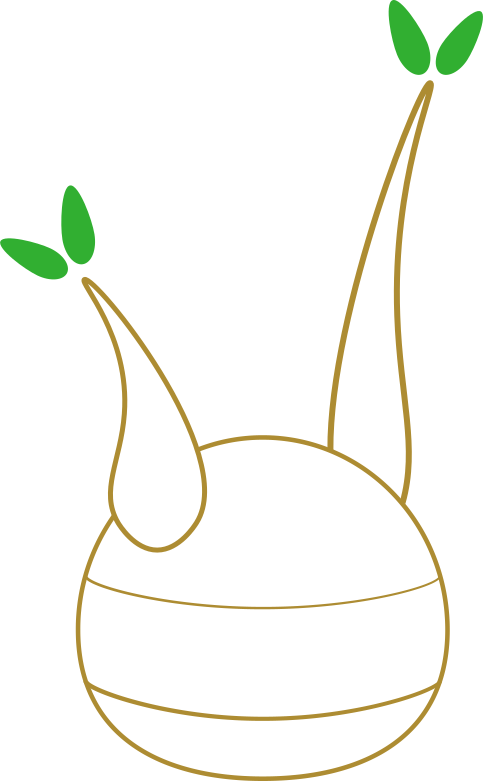

# caudex

[](https://github.com/wikibonsai/wikibonsai)
[](https://npmjs.org/package/caudex)

<p align="center">
  
</p>

.[^inspire]

An index/db for tracking complex relationships in collections, such as personal [wiki](https://github.com/wikibonsai/wikirefs)s, with support for a [semantic tree](https://github.com/wikibonsai/semtree).

🍄 Cultivate connections in your [🎋 WikiBonsai](https://github.com/wikibonsai/wikibonsai) digital garden.

## Install

Install with [npm](https://docs.npmjs.com/cli/v9/commands/npm-install):

```
npm install caudex
```

## Use

If you have some file data you want to store or index...

```js
import { Caudex } from 'caudex';

let fileData = [
  {
    id: '<some-unique-id>',
    filename: 'fname',
    uri: '/uri',
    title: 'Title',
    type: 'default',
  },
  // ...
];
const caudex = new Caudex(fileData);
```

...Or just a web (graph):

```js
import { Base } from './base';
import { Web } from './web';

class WebOnlyCaudex extends Web(Base) {}
const web = new WebOnlyCaudex(fileData);
```

...Or just a tree:

```js
import { Base } from './base';
import { Tree } from './tree';

class TreeOnlyCaudex extends Tree(Base) {}
const tree = new TreeOnlyCaudex(fileData);
```

### Async

Caudex is synchronously implemented, but asynchronous access can be facilitated by turning on the `thread` option:

```js
import { Caudex } from 'caudex';

let opts = { thread: true };
const caudex = new Caudex(fileData, opts);
```

Then subsequent calls to `caudex` will use [mutex locks](https://github.com/DirtyHairy/async-mutex) to ensure atomic access to the internal index.

## Terms

There is some terminology that will help in understanding the innerworkings of the `caudex` as well as the internal variable name choice.

### Data Structures

- Base: Basic functions of the index, such as storing the hash map of node id's to nodes and the ability to add/edit/remove nodes.
- Tree: A hierarchical structure; good for ordering information.
- Web: A graph structure; good for associative traversal.

Under the hood, the `caudex` is essentially one hash table whose keys are node ids and values are the nodes themselves. Properties (`all()`) and actions (`add()`, `edit()`, `rm()`) are all functions being run over the hash table to calculate the desired data. This implementation mirrors [pointers](https://en.wikipedia.org/wiki/Pointer_(computer_programming)), since [javascript/typescript doesn't have them](https://stackoverflow.com/questions/17382427/are-there-pointers-in-javascript#:~:text=No%2C%20JS%20doesn't%20have,the%20address%20of%20an%20object.). So, in pointer parlance, to "pass around a reference" you pass around a node id and to "dereference a pointer" in order to obtain the value (node) from the key (node id) in the hash table.

Mirroring pointer behavior allows for implementing tree and graph data structures that are truer to form. And, since most everything is a function, tree and web related functions are grouped into mix-ins that can be used (or not) based on need. By using the main `caudex`, which contains both `tree` and `web` functions, a hybrid tree-web data structure can be leveraged. ("web" can be thought of as synonymous with the computer science "graph" data structure)

The "base" portion handles all operations that would be expected in either the `tree` or `web` data structures, such as adding, editing, or removing a node.

### Function Kinds

- Properties: Methods that return a property of either the caudex or some node(s).
- Relational Properties: Methods that return relationship information of some node(s).
- Actions: Methods that perform some action on the caudex or some node(s).

As said before, the `caudex` is essentially a hash with a collection of functions to answer questions about the hash table. It is helpful to think of each function as fitting into one of a few categories that dictate how the function works and what it will return.

"Properties" are functions that describe the state of the `caudex`. For example, `all()` returns all of the node ids that currently exist and `nodetypes()` returns all of the nodetypes that exist.

"Relational properties" are functions that describe relationships between nodes and often take an `id: string` argument. For example, `ancestors(id: string)` returns an array of node ids that form the ancestry of the node with the given `id` and `backlinks(id: string)` returns an array of node ids who contain the node with the given `id` in its links.

Generally speaking, "property" and "relational property" functions will accept a `QUERY_TYPE` in addition to the required arguments. This can alter the return type based on need. For example, instead of receiving an array of node ids, by adding `QUERY_TYPE.NODE`, an array of all the nodes would be returned instead. See individual function docs for details.

Finally, "Actions" are functions that perform some action on the `caudex` or a node in the `caudex`. For example, `add(data: any)` will parse the data payload and add a new node based on the data if it is valid and `edit(id: string, key: any, newValue: any)` updates the value for a node with the given `id` at the givne `key`.

## Other Terms

There are also wikibonsai-specific terminologies that you can read more about [here](https://github.com/wikibonsai/wikibonsai/blob/main/docs/TERMS.md).

## API

'Properties', 'Relational Properties', and 'Actions' are all just methods. But properties describe the state of the caudex and relational properties describe the state of a node within the caudex, whereas actions change the state of the caudex.

Properties can be called with a `QUERY_TYPE`, which will determine the type of data returned.

### Base

#### 'Properties'

##### `all(): string[]`

Returns all node ids in the caudex.

##### `nodetypes(): string[]`

Returns an array of all nodetypes in the caudex.

##### `zombies(): string[]`

Returns an array of node ids for all zombie nodes in the caudex.

#### Actions

##### `has(id: string): boolean`

Verifies if a node id exists in the caudex; returns `true` if it does and `false` if it does not.

##### `flushData([id: string]): boolean`

Flushes / deletes node data. If no `id` is given, all data for all nodes is deleted. If an `id` is provided, then just the node data for the node with that id is flushed / deleted.

##### `flushRels(): boolean`

Flushes / deletes all node relationships, including family (tree) relationships and reference relationships (web) -- in the caudex.

##### `clear(): void`

Delete the entire caudex.

##### `add(data: any[, typeinfo: NodeTypeInfo]): Node | undefined`

Add a new node to the caudex with the given `data` payload. If the node was added, whether successfully or by generating a zombie node, return the Node. If no node was created successfully, then `undefined` is returned.

If an `id` is included in the `data` payload, it will be used as the node's id. If not, a new id will be generated for the node internally.

##### `edit(id: string, key: any, newValue: any): boolean`

Edit the node with the given `id` so that its `key` points to thew `newValue`. Returns `true` if the edit was successful and `false` if it failed.

##### `fill(id: string, data: any): Node | undefined`

Fill the zombie node with the given `id` via the given `data` payload. If the population was successful, the now-not-zombie-node will be returned. If population was not successful, `undefined` will be returned.

##### `get(id: string): Node | undefined`

Get the node with the given `id`. Returns the node if found and `undefined` if not found.

##### `find(key: any, value: any): Node | undefined`

Find a node in the caudex where it has a given `key` with the given `value` in its data. Returns the node if one is found and `undefined` if none is found.

This action requires that the `key` is one of the caudex's `uniqDataKeys`. If is not, try using `filter` instead.

##### `filter(key: any, value: any): Node[] | undefined`

Find all nodes in the caudex whose given `key` matches the given `value`. Returns an array of nodes with valid matches and `undefined` if none are found.

Alternatively, if the `key` is one of the caudex's `uniqKeys` `find` may be used instead to find a specific node.

##### `rm(id: string): boolean`

Remove / delete a node from the caudex with the given `id`. Returns `true` if the node was deleted successfully and `false` if not.

### Tree

#### Properties

##### `root(): string | undefined`

Returns the id of the root of the tree or `undefined` if none is set.

##### `orphans(treeIDs: string[]): string[] | undefined`

Returns all of the ids of orphan nodes in the tree of the caudex.

`treeIDs` defines what nodes should be considered part of the tree.

#### Relational Properties

##### `ancestors(id: string): string[]`

Return an array of node ids for all ancestor nodes (all nodes along the path from the root to the target node) to the node with the given `id`.

##### `parent(id: string): string`

Return the node id for the parent (the node above, which points the target node) of the node with the given `id`.

##### `siblings(id: string): string`

Return an array of node ids for the siblings (all nodes at the same level as the target node) of the node with the given `id`.

##### `children(id: string): string`

Return an array of node ids for the children (all nodes one level below the target node) of the node with the given `id`.

##### `descendants(id: string): string`

Return an array of node ids for the descendents (all nodes below the target node) of the node with the given `id`.

##### `lineage(id: string): string`

Return an array of node ids for the lineage (all ancestors and descendents, excluding the target node) of the node with the given `id`.

##### `level(id: string): number`

Returns the numeric level of the target node.

#### Actions

##### `flushRelFams()`

Flush / delete family relationships in the caudex.

##### `graft(parentID: string, childID: string): boolean`

Graft a node with the given `childID` to another node with the given `parentID`.

To perform subtree-sized changes, see [`transplant()`]().

##### `replace(source: string, target: string): Node | undefined`

Replace a `source` node's position in the tree with the `target` node via their IDs. The updated target node is returned on success.

##### `transplant(subrootID: string, subtree: { id: string, children: string[] }[]): boolean`

Replace a subtree in the tree with another subtree. This will return `true` if the subtree was successfully "transplanted" and the result was a valid tree. Otherwise, the original tree will be left alone and the function will return `false`.

##### `prune(parentID: string, childID: string): boolean`

Prune a node with the given `childID` from another node with the given `parentID`. This method will fail if the node with the given `childID` has children.

To perform subtree-sized changes, see [`transplant()`]().

##### `printTree()`

Print the tree to the console.

### Web

#### Properties

##### `floaters(): string[] | undefined`

Returns all of the ids of floater nodes in the graph of the caudex.

##### `reftypes(): Set<string>`

Return all reftypes in the caudex.

##### `attrtypes(): Set<string>`

Return all attrtypes in the caudex.

##### `linktypes(): Set<string>`

Return all linktypes in the caudex.

#### Relational Properties

##### (⚠️ coming soon!) `forerefs(id: string): Attrs | undefined`

##### (⚠️ coming soon!) `backrefs(id: string): Attrs | undefined`

##### `foreattrs(id: string): Attrs | undefined`

Returns foreward attributes for the given node id.

##### `backattrs(id: string): Attrs | undefined`

Returns back attributes fore the given node id.

##### `forelinks(id: string): Links | undefined`

Returns foreward links for the given node id.

##### `backlinks(id: string): Links | undefined`

Returns back links for the given node id.

##### `foreembeds(id: string): Embeds | undefined`

Returns foreward embeds for the given node id.

##### `backembeds(id: string): Embeds | undefined`

Returns back embeds for the given node id.

##### `neighbors(id: string): string[]`

Return an array of node ids for all neighbors / references.

#### Actions

##### `flushRelRefs([id: string]): boolean`

Flush / delete all reference relationships. If no id is given, flush all reference

##### `connect(ref: REL.REF, source: string, target: string): boolean`

Connect a `source` node id to a `target` node id via the given `ref` type (attr or link).

##### `retype(oldType: string, newType: string[, type: REL.REF]): boolean`

##### `transfer(source: string, target: string, kind: REL.REF = REL.REF.REF): Node | undefined`

Transfer the relationships from the `source` node to the `target` node via their IDs. Kind of relationships to transfer can be filtered by the `kind` var. Returns the target node on successful transfer.

##### `disconnect(ref: REL.REF, source: string, target: string): boolean`

Disconnect a `source` node id from a `target` node id of the given `ref` type (attr or link).

## TODO

- https://github.com/stopachka/datalogJS
- https://github.com/pouchdb/pouchdb


[^inspire]: Logo inspired by [databases](https://cdn-icons-png.flaticon.com/512/20/20093.png) and [caudexes](https://www.google.com/search?q=caudex&source=lnms&tbm=isch&sa=X&ved=2ahUKEwiD_LbPwr36AhUsRTABHdXOBq0Q_AUoAXoECAIQAw&biw=1011&bih=800&dpr=2) -- especially [this one](https://thumbs.dreamstime.com/z/adenium-shrub-branched-caudex-green-foliage-illustration-colored-pencils-229255411.jpg).
